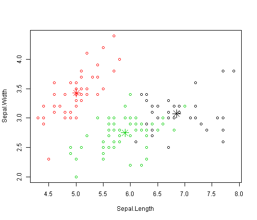

基于iris数据显示k-means聚类方法
========================================================
将iris数据集赋给iris2变量

```r
iris2<-iris
head(iris2)
```

```
##   Sepal.Length Sepal.Width Petal.Length Petal.Width Species
## 1          5.1         3.5          1.4         0.2  setosa
## 2          4.9         3.0          1.4         0.2  setosa
## 3          4.7         3.2          1.3         0.2  setosa
## 4          4.6         3.1          1.5         0.2  setosa
## 5          5.0         3.6          1.4         0.2  setosa
## 6          5.4         3.9          1.7         0.4  setosa
```

从iris2数据集中删除species变量

```r
iris2$Species<-NULL
head(iris2)
```

```
##   Sepal.Length Sepal.Width Petal.Length Petal.Width
## 1          5.1         3.5          1.4         0.2
## 2          4.9         3.0          1.4         0.2
## 3          4.7         3.2          1.3         0.2
## 4          4.6         3.1          1.5         0.2
## 5          5.0         3.6          1.4         0.2
## 6          5.4         3.9          1.7         0.4
```

对数据集iris2上应用kmeans()函数,并将聚类结果存储在result变量中，聚类数设置为3.

```r
result<-kmeans(iris2,3)
result
```

```
## K-means clustering with 3 clusters of sizes 38, 50, 62
## 
## Cluster means:
##   Sepal.Length Sepal.Width Petal.Length Petal.Width
## 1     6.850000    3.073684     5.742105    2.071053
## 2     5.006000    3.428000     1.462000    0.246000
## 3     5.901613    2.748387     4.393548    1.433871
## 
## Clustering vector:
##   [1] 2 2 2 2 2 2 2 2 2 2 2 2 2 2 2 2 2 2 2 2 2 2 2 2 2 2 2 2 2 2 2 2 2 2 2
##  [36] 2 2 2 2 2 2 2 2 2 2 2 2 2 2 2 3 3 1 3 3 3 3 3 3 3 3 3 3 3 3 3 3 3 3 3
##  [71] 3 3 3 3 3 3 3 1 3 3 3 3 3 3 3 3 3 3 3 3 3 3 3 3 3 3 3 3 3 3 1 3 1 1 1
## [106] 1 3 1 1 1 1 1 1 3 3 1 1 1 1 3 1 3 1 3 1 1 3 3 1 1 1 1 1 3 1 1 1 1 3 1
## [141] 1 1 3 1 1 1 3 1 1 3
## 
## Within cluster sum of squares by cluster:
## [1] 23.87947 15.15100 39.82097
##  (between_SS / total_SS =  88.4 %)
## 
## Available components:
## 
## [1] "cluster"      "centers"      "totss"        "withinss"    
## [5] "tot.withinss" "betweenss"    "size"         "iter"        
## [9] "ifault"
```

比较聚类结果各组种类数量

```r
table(iris$Species,result$cluster)
```

```
##             
##               1  2  3
##   setosa      0 50  0
##   versicolor  2  0 48
##   virginica  36  0 14
```

From the above result,we can see that cluster "setosa" can be easily separated from other clusters,and that clusters "versicoloer" and "virginica" are to a small degree overlapped with each other.Plot the clusters and their points.There are four dimensions in the data and that only the first two dimensions are used to draw the plot here.

```r
plot(iris2[c("Sepal.Length","Sepal.Width")],col=result$cluster)
points(result$centers[,c("Sepal.Length","Sepal.Width")],col=1:3,pch=8,cex=2)
```

 


