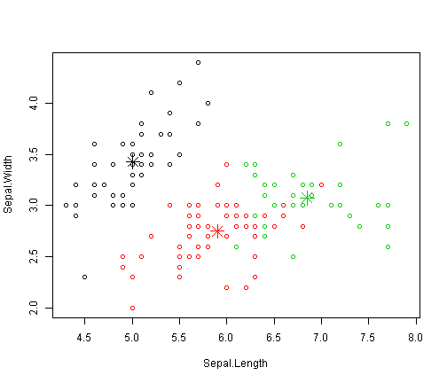

基于iris数据显示k-means聚类方法
========================================================

将iris数据集赋给iris2变量

```r
iris2<-iris
head(iris2)
```

```
##   Sepal.Length Sepal.Width Petal.Length Petal.Width Species
## 1          5.1         3.5          1.4         0.2  setosa
## 2          4.9         3.0          1.4         0.2  setosa
## 3          4.7         3.2          1.3         0.2  setosa
## 4          4.6         3.1          1.5         0.2  setosa
## 5          5.0         3.6          1.4         0.2  setosa
## 6          5.4         3.9          1.7         0.4  setosa
```

从iris2数据集中删除species变量

```r
iris2$Species<-NULL
head(iris2)
```

```
##   Sepal.Length Sepal.Width Petal.Length Petal.Width
## 1          5.1         3.5          1.4         0.2
## 2          4.9         3.0          1.4         0.2
## 3          4.7         3.2          1.3         0.2
## 4          4.6         3.1          1.5         0.2
## 5          5.0         3.6          1.4         0.2
## 6          5.4         3.9          1.7         0.4
```

对数据集iris2上应用kmeans()函数，并将聚类结果存储在result变量中，聚类数设置为3

```r
result<-kmeans(iris2,3)
result
```

```
## K-means clustering with 3 clusters of sizes 50, 62, 38
## 
## Cluster means:
##   Sepal.Length Sepal.Width Petal.Length Petal.Width
## 1     5.006000    3.428000     1.462000    0.246000
## 2     5.901613    2.748387     4.393548    1.433871
## 3     6.850000    3.073684     5.742105    2.071053
## 
## Clustering vector:
##   [1] 1 1 1 1 1 1 1 1 1 1 1 1 1 1 1 1 1 1 1 1 1 1 1 1 1 1 1 1 1 1 1 1 1 1 1
##  [36] 1 1 1 1 1 1 1 1 1 1 1 1 1 1 1 2 2 3 2 2 2 2 2 2 2 2 2 2 2 2 2 2 2 2 2
##  [71] 2 2 2 2 2 2 2 3 2 2 2 2 2 2 2 2 2 2 2 2 2 2 2 2 2 2 2 2 2 2 3 2 3 3 3
## [106] 3 2 3 3 3 3 3 3 2 2 3 3 3 3 2 3 2 3 2 3 3 2 2 3 3 3 3 3 2 3 3 3 3 2 3
## [141] 3 3 2 3 3 3 2 3 3 2
## 
## Within cluster sum of squares by cluster:
## [1] 15.15100 39.82097 23.87947
##  (between_SS / total_SS =  88.4 %)
## 
## Available components:
## 
## [1] "cluster"      "centers"      "totss"        "withinss"    
## [5] "tot.withinss" "betweenss"    "size"         "iter"        
## [9] "ifault"
```

比较聚类结果中各组Species的数目

```r
table(iris$Species,result$cluster)
```

```
##             
##               1  2  3
##   setosa     50  0  0
##   versicolor  0 48  2
##   virginica   0 14 36
```

从结果中可以看出，聚类“setosa”能够很容易的与其他聚类分开，而聚类"versicolor"和“virginica”与其他有小程度的覆盖。

下面绘制一下各个聚簇及他们的中心，数据中有4个维度，下面只绘制2个维度。在图形显示中一些黑点离绿色中心比离黑色中心更近。由于初始随机选择的聚类中心不同，k-均值聚类的结果每次运行都会不同。

```r
plot(iris2[c("Sepal.Length","Sepal.Width")],col=result$cluster)
points(result$centers[,c("Sepal.Length","Sepal.Width")],col=1:3,pch=8,cex=2)
```

 
绘制中心点


