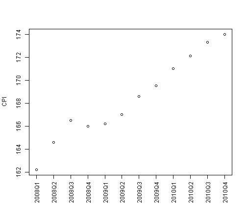
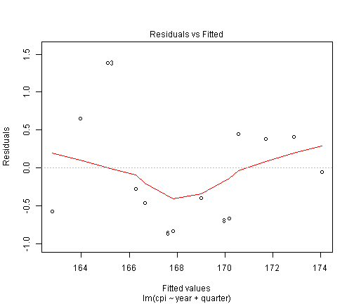
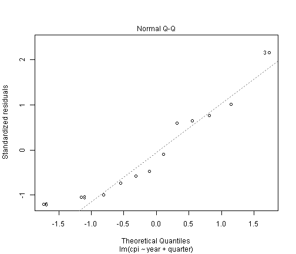
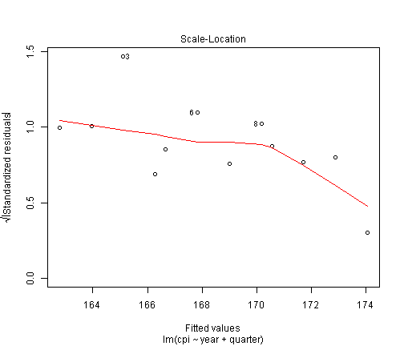
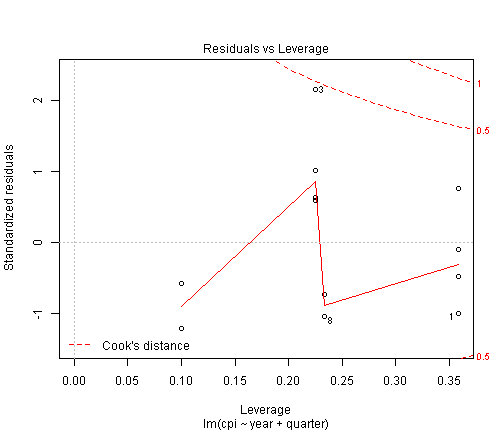
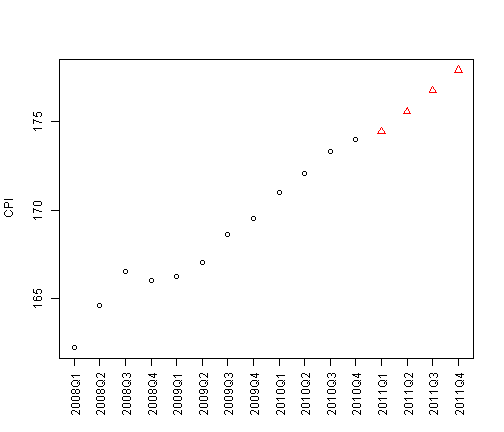

通过回归模型预测CPI数据案例
========================================================

回归分析是建立自变量(预测变量)和因变量(响应变量)的函数关系式。通过自变量的变化来预测因变量的结果。如果自变量只有一个变量称为单变量线性回归，如果自变量有多个称为多变量线性回归。函数关系式如下:
    
       y=c0+c1x1+c2x2+...+ckxk

其中x1,x2,...,xk为自变量，y是因变量

下面使用lm函数实现回归预测
------------------------------
init CPI,year,quarter data

```r
cpi<-c(162.2,164.6,166.5,166.0,166.2,167.0,168.6,169.5,171.0,172.1,173.3,174.0)
year<-rep(2008:2010,each=4)
quarter<-rep(1:4,3)
```

Draw CPI Plot and axis.The param **"xaxt"** in plot function specifies the x axis type.Specifying "n" suppresses plotting of the axis.The first param in axis function specifies which side of the plot the axis is to be drawn on.The param **"at"** specifies the points at which tick-marks are to be drawn.The param **"las"** specifies the style of axis labels.3=always vertical


```r
plot(cpi,xaxt="n",ylab="CPI",xlab="")
axis(1,paste(year,quarter,sep="Q"),at=1:12,las=3)
```

 

Then check the correlation between CPI and the other variables:**year** and **quarter**.

```r
cor(year,cpi)
```

```
## [1] 0.9096316
```

```r
cor(quarter,cpi)
```

```
## [1] 0.3738028
```

Then we can built a linear regression on the data,using **year** and **quarter** as predictors and **CPI** as response.


```r
fit<-lm(cpi~year+quarter)
fit
```

```
## 
## Call:
## lm(formula = cpi ~ year + quarter)
## 
## Coefficients:
## (Intercept)         year      quarter  
##   -7644.487        3.887        1.167
```
With the above liner model,the formula for CPI is :

   __cpi=c0 + c1\*year + c2\*quarter__
 
where c0,c1 and c2 are coefficients from model **fit**. Therefore,the CPI in 2011 can be get as follows:

```r
fitcoeff<-fit$coefficients
cpi2011<-fitcoeff[[1]]+fitcoeff[[2]]*2011+fitcoeff[[3]]*(1:4)
cpi2011
```

```
## [1] 174.4417 175.6083 176.7750 177.9417
```
   
Look the details of the model:

```r
attributes(fit)
```

```
## $names
##  [1] "coefficients"  "residuals"     "effects"       "rank"         
##  [5] "fitted.values" "assign"        "qr"            "df.residual"  
##  [9] "xlevels"       "call"          "terms"         "model"        
## 
## $class
## [1] "lm"
```

Look the differences between observed values and fited values:

```r
residuals(fit)
```

```
##           1           2           3           4           5           6 
## -0.57916667  0.65416667  1.38750000 -0.27916667 -0.46666667 -0.83333333 
##           7           8           9          10          11          12 
## -0.40000000 -0.66666667  0.44583333  0.37916667  0.41250000 -0.05416667
```

Look the summary of the model:

```r
summary(fit)
```

```
## 
## Call:
## lm(formula = cpi ~ year + quarter)
## 
## Residuals:
##     Min      1Q  Median      3Q     Max 
## -0.8333 -0.4948 -0.1667  0.4208  1.3875 
## 
## Coefficients:
##               Estimate Std. Error t value Pr(>|t|)    
## (Intercept) -7644.4875   518.6543 -14.739 1.31e-07 ***
## year            3.8875     0.2582  15.058 1.09e-07 ***
## quarter         1.1667     0.1885   6.188 0.000161 ***
## ---
## Signif. codes:  0 '***' 0.001 '**' 0.01 '*' 0.05 '.' 0.1 ' ' 1
## 
## Residual standard error: 0.7302 on 9 degrees of freedom
## Multiple R-squared:  0.9672,	Adjusted R-squared:  0.9599 
## F-statistic: 132.5 on 2 and 9 DF,  p-value: 2.108e-07
```

draw plots of the model:

```r
plot(fit)
```

    
下面使用predict预测2011年CPI
-------------------------------------------

Create a **data.frame** for 2011.Then Make a prediction for newdata base on above **fit** model.

```r
data2011<-data.frame(year=2011,quarter=1:4)
cpi2011<-predict(fit,newdata=data2011)
style<-c(rep(1,12),rep(2,4))
```

Draw the predict plot.

```r
plot(c(cpi,cpi2011),xaxt="n",ylab="CPI",xlab="",pch=style,col=style)
axis(1,at=1:16,las=3,labels=c(paste(year,quarter,sep="Q"),"2011Q1","2011Q2","2011Q3","2011Q4"))
```

 
